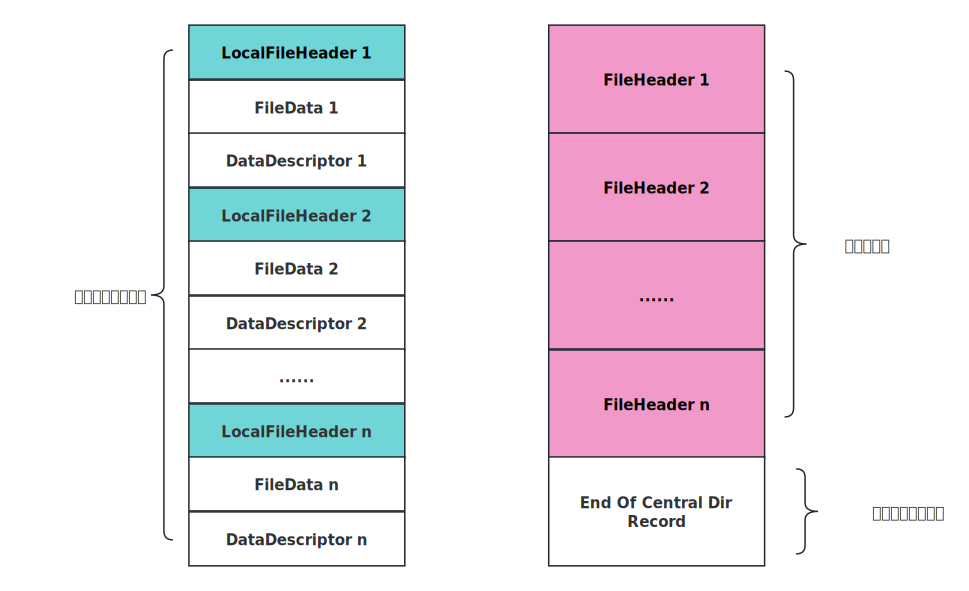

# ZIP压缩格式详解

## ZIP文件格式介绍

ZIP文件结构由**数据存储区、中央目录区和目录结束标识**三大部分组成。如下图所示：

整个ZIP文件由三部分拼接而成。下面分别针对这三部分对ZIP文件的格式进行详解。

### 源文件数据存储区

源文件数据存储区由三大部分组成：**Local File header、File data 和 Data Descriptor**。其中**Local File Header**包含了其对应的文件的各种信息，**File Data**是经过压缩的（或者没有压缩的）源数据文件，**Data Descriptor**则是标识压缩的结果信息。

#### Local File header

在**Local File Header**中，一般包含以下信息：

|偏移字节索引|字节数|类型|描述|
|--|--|--|--|
|0|4|`uint32_t`|用于标识的固定值 `0x04034b50`|
|4|2|`uint16_t`|解压缩的版本号 version|
|6|2|`uint16_t`|标志 flag|
|8|2|`uint16_t`|压缩方式 compression|
|10|2|`uint_16`|文件的最后修改时间 last_modify_time|
|12|2|`uint16_t`|文件的最后修改日期 last_modify_date|
|14|4|`uint32_t`|CRC-32 校验码 crc32|
|18|4|`uint32_t`|压缩后的大小 compressed_size|
|22|4|`uint32_t`|压缩前的大小 uncompressed_size|
|26|2|`uint16_t`|文件名长度（n）|
|28|2|`uint16_t`|扩展字段长度（m）|
|30|n|``||
|30+n|m|||

